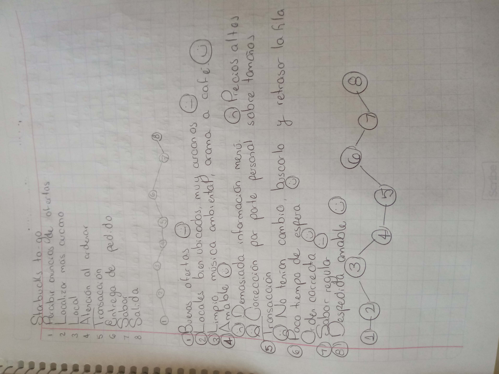

# Ejercicios prácticos. User persona y Journey map

Al realizar el journey map de mi experiencia al consumir un café Starbucks tomé en 
cuenta lo siguiente: 
- El journey map nos ayuda a visibilizar la experiencia que un usuario tiene ante 
  un producto o servicio. 
- A través de él es posible identificar touch points, pain points y puntos de mejora. 
- Existe un journey map TO BE y un journey map AS IS. 

Al elaborarlo es necesario identificar:
- Las etapas de la experiencia por las que pasa el usuario.
- Las acciones que lleva a cabo el usuario en cada etapa.
- Los puntos de contacto (touch points) en los que se relaciona con la marca.
- Los actores que están presentes en cada parte del journey.
- Las emociones que experimenta el usuario durante su experiencia para identificar los 
  puntos de mejora y pain points. 

Primer acercamiento realizado: 

Por otra parte, al crear la user persona de la cantante de ópera que sería la usuaria 
de mi producto: 
- Me concentré en la creación de un “personaje ficticio” que usaría para entender a mis 
  usuarios objetivo, según patrones de conducta y  emocionales.
- Las user persona nos ayudan a tomar decisiones informadas que alimenten el proceso de 
  diseño de mi producto o servicio.
- Es importante definir los aspectos etnográficos, demográficos y psicológicos que investigaré 
  para crear mi persona, previo a realizarla.

  Por lo que en mi investigación me enfoqué en conocer más sobre el contexto de las cantantes
  de ópera, en específico. Encontré lo demandante que resulta desempeñarse como cantantes 
  de ópera, los cuidados de salud que deben llevar a cabo de manera rutinaria, la falta de 
  oportunidades de trabajo, así como la constante presión y movilidad en la que se ven envueltas. 
  Por lo que decidí crear una aplicación que se enfocara en la creación de hábitos en pro de la salud 
  mental personal. Respondiendo a la necesidad de una mejora en la salud personal de las 
  cantantes, siendo esta parte primordial de su desempeño diario. 

  
Primer acercamiento realizado: 

